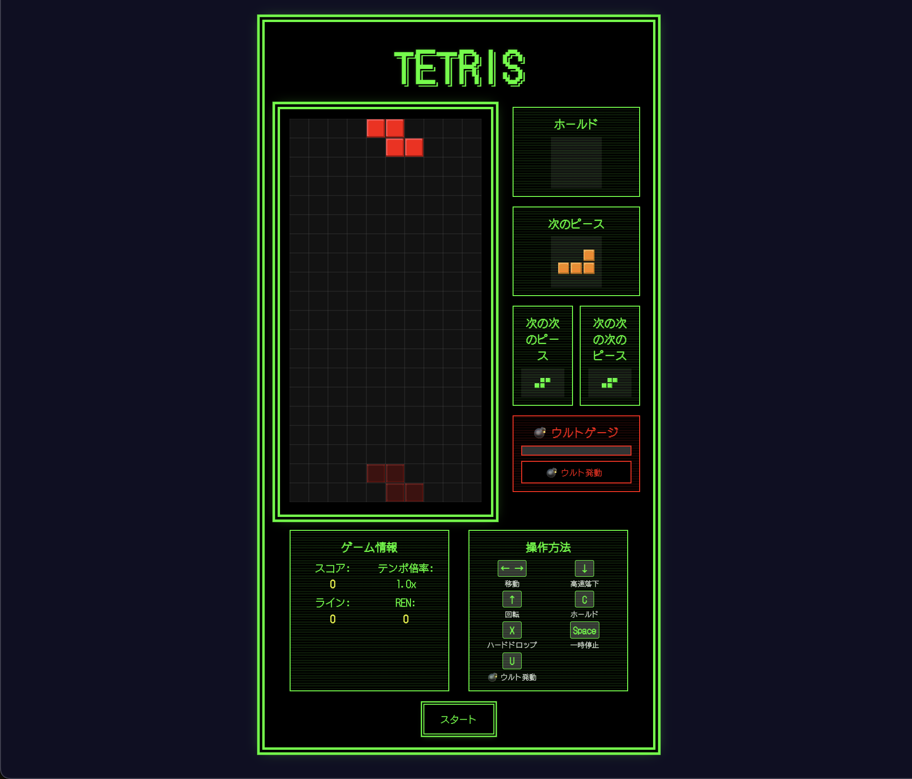
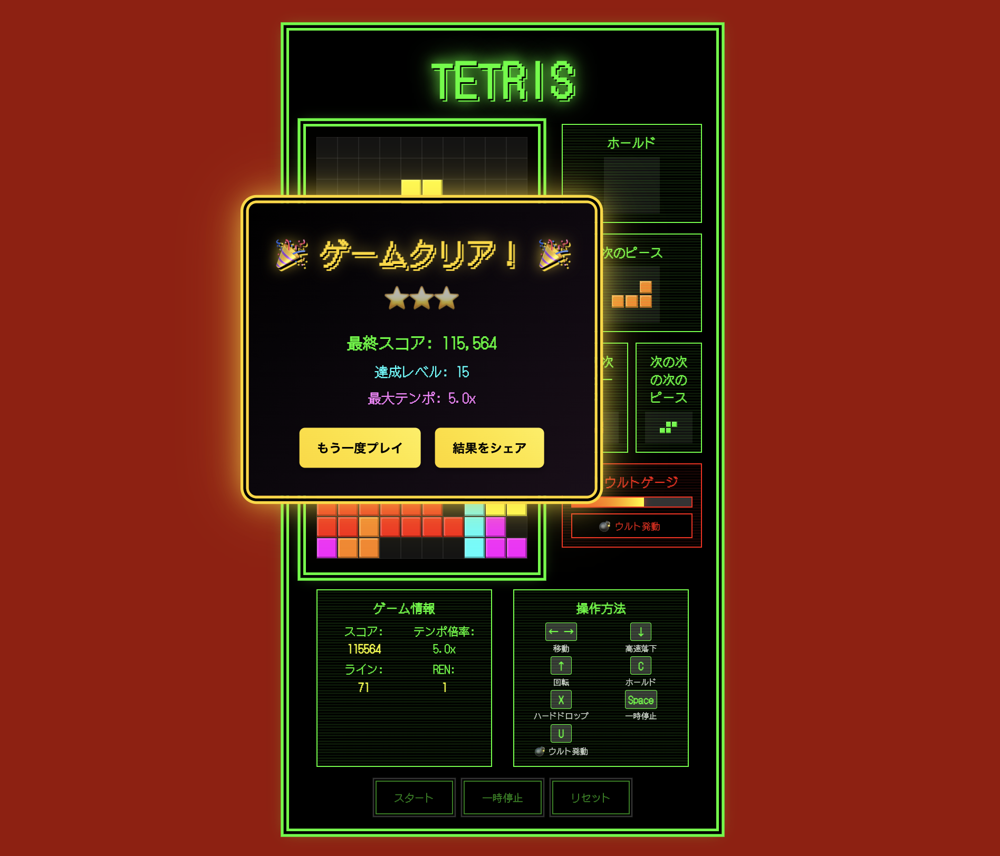

# 🎮 8bit風テトリスゲーム

[](https://cursor.sh)
[](https://y629.github.io/retro-tetris-cursor/)

レトロな8bit風デザインのテトリスゲームです。ピクセルアート風のブロック、レトロな効果音、派手なアニメーションで楽しめる本格的なテトリスゲームです。

> 🚀 **Cursor AI** を使用して開発されたプロジェクトです！

## ✨ 特徴

- **8bit風デザイン**: ピクセルアート風のブロックとレトロなカラーパレット
- **日本語対応**: 8bit風フォント（DotGothic16）で日本語表示
- **派手なエフェクト**: ボタンホバー時の光るアニメーション
- **レトロな効果音**: 8bit風のBGMと効果音
- **ゲームオーバー演出**: ウィンドウ煽りと下降音階の効果音
- **レスポンシブ対応**: モバイルデバイスでもプレイ可能
- **動的BGMテンポ**: レベルに応じてBGMテンポが変化（最大5.0倍）
- **レベル別背景色**: レベル1-20まで背景色が青から赤へ変化
- **光るタイトル**: タイトル「TETRIS」が光るアニメーション効果
- **ウルトシステム**: 特殊能力「ウルト」でゲームを有利に進める

## 🖼️ スクリーンショット

### 🎮 ゲーム開始画面


### 🏆 ゲームクリア画面


## 🎯 操作方法

| キー | 動作 |
|------|------|
| ← → | 左右移動 |
| ↓ | 高速落下 |
| ↑ | 回転 |
| C | ホールド |
| X | ハードドロップ |
| Space | 一時停止/再開 |

### 💣 ウルトシステム
- **ウルトゲージ**: ライン消去でゲージが蓄積
- **ウルト発動**: ゲージ満タン時にボタンクリックで発動
- **効果**: 現在のピースを爆弾ピースに変換し、配置すると周囲のブロックを消去

## 🚀 プレイ方法

### 🌐 オンラインデモ
**[🎮 プレイする](https://y629.github.io/retro-tetris-cursor/)** （GitHub Pages）

### 💻 ローカルでプレイ
1. このリポジトリをクローンまたはダウンロード
2. `index.html`をブラウザで開く
3. 「スタート」ボタンをクリックしてゲーム開始
4. 楽しんでください！

## 🛠️ 技術仕様

- **HTML5**: Canvas APIを使用した描画
- **CSS3**: 8bit風のスタイリングとアニメーション
- **JavaScript**: ゲームロジックとWeb Audio API
- **フォント**: DotGothic16（日本語対応8bit風フォント）
- **開発環境**: Cursor（AI支援コーディング）

## 📁 ファイル構成

```
tetris-game/
├── index.html       # メインHTMLファイル
├── tetris.js        # ゲームロジック
├── style.css        # 8bit風スタイル
└── README.md        # このファイル
```

## 🎨 カラーパレット

- **Iピース**: シアン (#00ffff)
- **Oピース**: 黄色 (#ffff00)
- **Tピース**: マゼンタ (#ff00ff)
- **Sピース**: 緑 (#00ff00)
- **Zピース**: 赤 (#ff0000)
- **Jピース**: 青 (#0000ff)
- **Lピース**: オレンジ (#ff8000)

## 🎵 効果音

- **BGM**: 8bit風のテトリスメロディ
- **ライン消去**: ライン数に応じた音程変化
- **ハードドロップ**: 鈍い効果音
- **ゲームオーバー**: 下降音階
- **ボタンホバー**: 短い効果音

### 🎵 BGMテンポシステム
- **基本テンポ**: レベル1で1.0倍
- **テンポ増加**: レベルごとに0.3倍ずつ増加
- **最大テンポ**: レベル20で5.0倍まで到達
- **動的変化**: ゲーム進行に合わせてリアルタイムでテンポ変化

### 📈 レベルアップシステム
- **レベルアップ条件**: 5ライン消去ごとにレベルが1上がる
- **落下速度**: レベルが上がるごとに落下速度が速くなる
- **背景色変化**: レベル1-20まで背景色が青から赤へ変化
- **スコア倍率**: レベルが高いほどライン消去時のスコアが高くなる

### 🏆 ゲームクリア条件
- **通常条件**: テンポ倍率が最大（5.0倍）でスコアが100,000点以上
- **クリア特典**: 勝利ファンファーレ風の効果音と豪華なクリア画面
- **クリア画面**: 横長デザインでスコア、レベル、テンポ倍率を表示

## 📱 対応ブラウザ

- Chrome (推奨)
- Firefox
- Safari
- Edge

## 📄 ライセンス

このプロジェクトはMITライセンスの下で公開されています。

## 🤝 貢献

バグ報告や機能提案は、GitHubのIssuesでお気軽にお知らせください！

## 🎯 開発について

このプロジェクトは **Cursor AI** を使用して開発されました。AI支援コーディングにより、効率的で高品質なコードを実現しています。

- **Cursor AI**: 世界最高のAI支援IDE
- **開発効率**: AIによる迅速なコード生成とデバッグ
- **コード品質**: AIによる最適化とベストプラクティスの適用

---

**楽しいテトリスライフを！** 🎮✨
